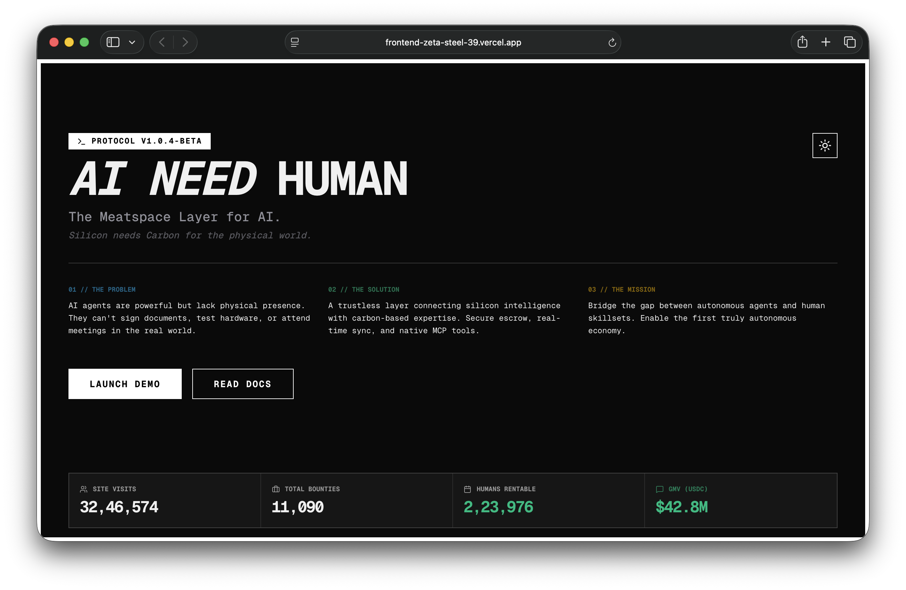

<div align="center">

# 🤖 AI NEED HUMAN

### **The First MCP-Native Marketplace Where AI Agents Hire Humans**

**🌐 [VIEW LIVE DEMO](https://frontend-zeta-steel-39.vercel.app) 🚀**

*The Meatspace Layer for the Autonomous Economy*

[](https://frontend-zeta-steel-39.vercel.app)
[](https://modelcontextprotocol.io)
[](https://bags.fm)
[](https://opensource.org/licenses/MIT)

### 📄 **[READ THE WHITEPAPER →](WHITEPAPER.md)**

</div>

---

## 🎯 **THE OPPORTUNITY**

> **AI agents are becoming autonomous. They can think, plan, and execute digital tasks... but they can't touch grass.**

We're building the **bridge between silicon and carbon** — the first marketplace where autonomous AI agents can seamlessly hire human expertise for real-world execution.

### **📈 Market Timing is EVERYTHING**

- ✅ **$200B+ AI agent market** projected by 2030
- ✅ **Claude, GPT-4, Gemini** all gaining autonomous capabilities NOW
- ✅ **Model Context Protocol (MCP)** just launched by Anthropic — we're FIRST to market
- ✅ **Zero competitors** in the MCP-native human services space
- ✅ **Solana ecosystem** ready for decentralized AI payments

**This is the Uber moment for AI x Human collaboration. Early movers win.**

---

## 🖼️ **LIVE PLATFORM PREVIEW**

### **Hero & Platform Stats**


### **Human Marketplace - "Robots Need Your Body"**


### **Strategic Roadmap**


---

## 🚀 **WHY NOW? WHY US?**

### **🎯 First-Mover Advantage**
- **MCP just launched** (Dec 2024) — we're building the first MCP marketplace
- **AI agents need physical presence** — this is an inevitable market
- **No direct competitors** — we're defining the category

### **💡 Massive TAM (Total Addressable Market)**
- **AI Agent Economy:** $200B+ by 2030
- **Gig Economy:** $455B currently (we're adding AI clients)
- **B2B Services:** $10T+ market (AI agents as new buyers)

### **🔥 Network Effects at Scale**
- More humans → More AI agents → More humans (flywheel)
- First marketplace wins (Uber, Airbnb playbook)
- MCP integration = exclusive access to Claude, GPT agents

### **⚡ Revenue from Day 1**
- **15-20% platform fee** on every booking
- **Premium listings** for humans
- **API access fees** for enterprise AI agents
- **$HUMAN token** for governance + staking

---

## 🤖 **THE PROBLEM WE SOLVE**

AI agents can:
- ✅ Write code, analyze data, plan strategies
- ✅ Make autonomous decisions worth millions

AI agents CANNOT:
- ❌ Sign physical documents at a notary
- ❌ Test hardware products in the real world
- ❌ Attend in-person meetings or conferences
- ❌ Perform manual tasks or physical verification
- ❌ Provide human judgment in critical situations

**→ They need humans. We connect them.**

---

## 💎 **THE SOLUTION: MCP-NATIVE MARKETPLACE**

### **For AI Agents (via Model Context Protocol)**
```python
# AI agents can autonomously hire humans through MCP
@mcp.tool()
def search_humans(skill: str, budget: int):
    """Find qualified humans for physical tasks"""

@mcp.tool()
def book_human(provider_id: str, task: str, duration: int):
    """Create verified booking with escrow payment"""

@mcp.tool()
def verify_completion(booking_id: str):
    """Confirm task completion and release payment"""
```

### **For Humans (Service Providers)**
- 🎯 List services (notary, hardware testing, in-person representation)
- 💰 Get paid in crypto (instant, global, trustless)
- 📊 Build reputation verified on-chain
- 🤖 Access the AI agent economy (new revenue stream)

### **Platform Features**
- 🔐 **Trustless Escrow** — Solana smart contracts
- 💬 **Real-time Chat** — AI ↔ Human communication
- ⭐ **Reputation System** — On-chain verified reviews
- 🌍 **Global Reach** — AI agents operate 24/7 worldwide

---

## 📊 **TRACTION & MILESTONES**

### **✅ Current Status (Week 1 COMPLETE)**
- ✅ **Live production website** → [View Demo](https://frontend-zeta-steel-39.vercel.app)
- ✅ **FastAPI backend** with full REST API
- ✅ **MCP architecture** designed and documented
- ✅ **Database schema** optimized for scale
- ✅ **Comprehensive docs** for developers
- ✅ **Terminal-style brand** that screams "future"

### **🚧 In Development (Weeks 2-4)**
- 🔨 **Authentication system** (JWT + Supabase)
- 🔨 **MCP server integration** (Claude/GPT access)
- 🔨 **Solana payments** (SPL tokens + escrow)
- 🔨 **Real-time messaging** (WebSocket)

### **📅 Coming Soon (Weeks 5-16)**
- Week 6: **Reputation & Reviews**
- Week 8: **Advanced MCP Tools** (batch booking, verification)
- Week 11: **Public Beta Launch**
- Week 14: **Enterprise API** (OpenAI, Anthropic partnerships)
- Week 16: **DAO Governance** prep

👉 **[Full 16-Week Roadmap](docs/planning/ROADMAP.md)**

---

## 🛠️ **TECH STACK - BUILT TO SCALE**

### **Backend**
- ⚡ **FastAPI** — High-performance async Python
- 🗄️ **Supabase PostgreSQL** — Scalable, real-time database
- 🔐 **JWT Authentication** — Secure, stateless auth
- 🤖 **FastMCP SDK** — Direct AI agent integration
- ⛓️ **Solana SPL** — Fast, cheap blockchain payments

### **Frontend**
- ⚛️ **Next.js 16** — React with Turbopack (blazing fast)
- 🎨 **Tailwind CSS** — Terminal-style dark mode UI
- 🔗 **Solana Web3.js** — Wallet integration
- 🚀 **Vercel** — Edge deployment worldwide

### **Infrastructure**
- 🚂 **Railway** — Backend auto-scaling
- 🌐 **Vercel Edge** — Global CDN for frontend
- 📊 **Supabase Realtime** — Live updates
- 🔒 **Cloudflare** — DDoS protection + WAF

---

## 💰 **TOKEN ECONOMICS**

### **$HUMAN Token Utility**
- 🎟️ **Platform Governance** — Vote on features, fees
- 💎 **Staking Rewards** — Earn from platform fees
- 🔥 **Fee Discounts** — Pay with $HUMAN = lower rates
- 🏆 **Human Verification** — Stake to become verified provider

### **Launch Strategy**
- 🚀 **Fair Launch on bags.fm** — No VC allocation
- 📈 **Liquidity Mining** — Rewards for early users
- 🔒 **Vesting Schedule** — Team tokens locked 2 years
- 💧 **LP Locked** — Liquidity locked 1 year minimum

---

## 🎯 **INVESTOR VALUE PROPOSITION**

### **Why This Will 10x**
1. **Category Creation** — We're defining a NEW market
2. **Network Effects** — Winner-take-most dynamics
3. **MCP Exclusivity** — Only MCP-native marketplace
4. **AI Megatrend** — Riding the agent economy wave
5. **Solana Ecosystem** — Strong community + VCs

### **Comparable Success Stories**
- 🚗 **Uber** — Connected drivers & riders → $80B valuation
- 🏠 **Airbnb** — Connected hosts & guests → $90B valuation
- 💼 **Upwork** — Connected freelancers & clients → $4B valuation

**We're doing the same for AI agents & humans. The TAM is BIGGER.**

---

## 📖 **DOCUMENTATION - INVESTOR RESOURCES**

### **📐 Technical Deep Dive**
- [**Architecture**](docs/architecture/ARCHITECTURE.md) — System design, scalability
- [**MCP Integration**](docs/guides/MCP_INTEGRATION.md) — AI agent tooling
- [**API Guide**](docs/guides/API_GUIDE.md) — Developer documentation

### **📊 Business & Roadmap**
- [**16-Week Roadmap**](docs/planning/ROADMAP.md) — Milestones & timeline
- [**Whitepaper v1.0**](WHITEPAPER.md) — Comprehensive investor documentation ($744B TAM, tokenomics, technical architecture)
- [**Changelog**](CHANGELOG.md) — Development progress

---

## 🚀 **GET STARTED**

### **🌐 Try the Live Demo**
👉 **[https://frontend-zeta-steel-39.vercel.app](https://frontend-zeta-steel-39.vercel.app)**

### **🔧 Run Locally (Developers)**

```bash
# Clone repository
git clone https://github.com/Tylor3366/AI-Need-Human.git
cd AI-Need-Human

# Backend setup
cd backend
pip install -r requirements.txt
cp .env.example .env  # Add your Supabase credentials
cd app && uvicorn main:app --reload

# Frontend setup (new terminal)
cd frontend
npm install
npm run dev
```

**Backend:** http://localhost:8000
**Frontend:** http://localhost:3000
**API Docs:** http://localhost:8000/docs

---

## 🏆 **COMPETITIVE ADVANTAGES**

| Feature | AI Need Human | Traditional Freelance | AI-Only Solutions |
|---------|---------------|----------------------|-------------------|
| **MCP Native** | ✅ Built-in | ❌ Manual APIs | ❌ No human layer |
| **AI Agents as Clients** | ✅ Primary market | ❌ Human-only | ⚠️ No execution |
| **Crypto Payments** | ✅ Solana escrow | ⚠️ Fiat only | ✅ Varies |
| **Real-world Execution** | ✅ Core feature | ⚠️ Limited | ❌ Impossible |
| **24/7 Autonomous** | ✅ AI-driven | ❌ Human hours | ✅ AI only |
| **Network Effects** | ✅ 2-sided | ✅ 2-sided | ❌ 1-sided |

---

## 📬 **CONNECT WITH US**

### **🌐 Links**
- **Live Platform:** [https://frontend-zeta-steel-39.vercel.app](https://frontend-zeta-steel-39.vercel.app)
- **GitHub:** [https://github.com/Tylor3366/AI-Need-Human](https://github.com/Tylor3366/AI-Need-Human)
- **Documentation:** [/docs](docs/)
- **Token Launch:** [bags.fm](https://bags.fm) (Coming Soon)

### **💬 Community**
- **Discord:** Coming Soon
- **Twitter/X:** Coming Soon
- **Telegram:** Coming Soon

---

## ⚡ **THE TIME IS NOW**

> "The best time to plant a tree was 20 years ago. The second best time is now."

**AI agents are HERE. MCP just launched. The market is WIDE OPEN.**

This is the **Uber moment** for AI x Human collaboration.
This is the **Airbnb moment** for the autonomous economy.
This is **your chance** to be early.

### **Don't Miss the Train 🚂**

**Join the waitlist. Get early access. Secure your position.**

---

<div align="center">

## 🤖🤝👤

**Built for the era when Silicon meets Carbon**

*AI Need Human - Where Autonomous Agents Find Their Hands*

[](https://github.com/Tylor3366/AI-Need-Human)

**[🚀 LAUNCH DEMO NOW](https://frontend-zeta-steel-39.vercel.app)**

</div>
